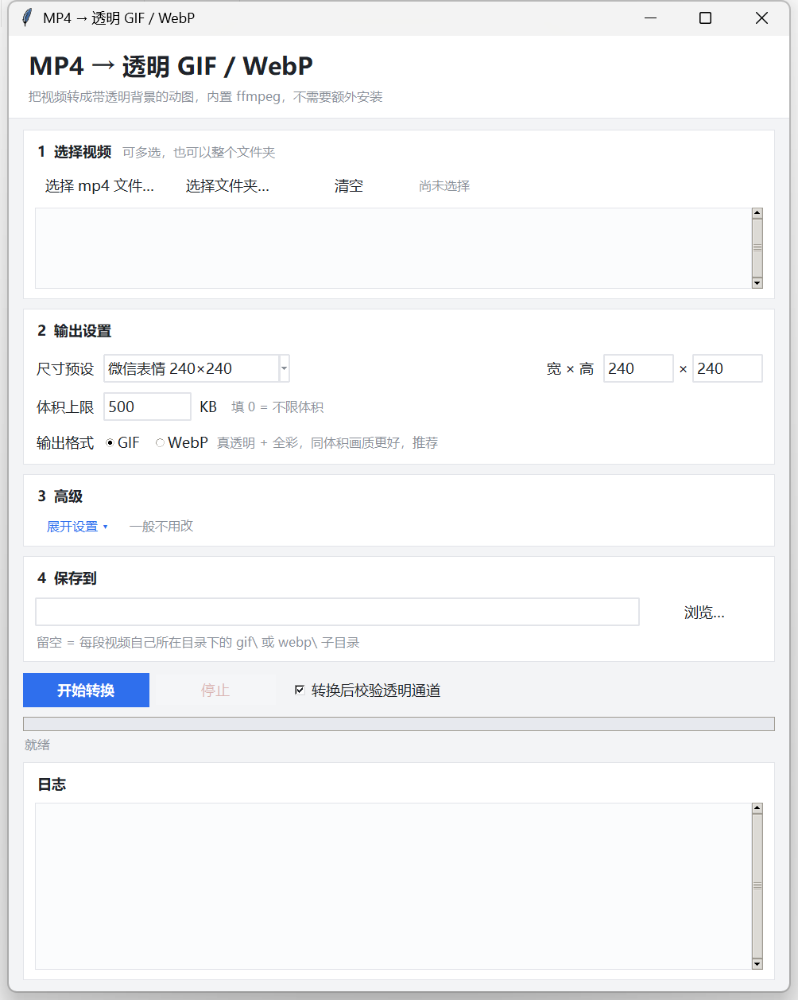

# MP4 to Transparent GIF · MP4 转透明 GIF

<div align="center">
  <a href="README.md">中文</a> · <b>English</b>
</div>

<div align="center">

[](LICENSE)
[](https://github.com/AFAP/mp4-to-gif/releases/latest)
[](https://github.com/AFAP/mp4-to-gif/actions/workflows/release.yml)

</div>

> **Turn an mp4 into a transparent-background GIF / WebP in one click.**
> A single-file exe with ffmpeg and the Python runtime bundled in — double-click and go. Every trick we learned about keying white backgrounds, keeping edges clean and hitting a size budget is baked into the code.



> Below is a transparent GIF produced by this tool from `samples/yuejianglou.mp4` (`screenshot/demo.gif` — the transparency only shows against a dark background):


## 1. What it solves

Turning an AI-generated animation into a chat sticker involves a pile of manual work: the video background is white, but GIF only supports 1-bit transparency — naive keying leaves white fringes and jagged edges; WeChat stickers are capped at 500 KB, so you end up hand-tuning frame rate against colour count; and off-the-shelf converters either ignore transparency or smear the line art into mush.

This tool wraps the whole pipeline into one double-clickable program:

```
 mp4 source (white-background animation)
        │
        │  1) ffmpeg frame extraction + lanczos scaling (key at 768 px long edge,
        │     then downsample to the target size)
        ▼
   near-white connected-component keying ── only white regions connected to the
        │                                   frame border are removed, so white parts
        │                                   inside the subject survive
        │  2) edge colour extrapolation: RGB of transparent pixels is replaced by the
        │     nearest opaque pixel, so scaling cannot bleed white into dark outlines
        │  3) white keyline rebuild: a ring of pure white is grown along the contour,
        │     otherwise dark line art disappears on dark chat backgrounds
        ▼
   palette quantisation (optional palette-only saturation boost, zero size cost)
        │
        │  4) size ladder: start from the highest frame rate and step down until the
        │     output fits the size budget
        ▼
   GIF (1-bit transparency / 256 colours)   or   WebP (true alpha / full colour)
```

## 2. Features

- ✅ Keys only white regions connected to the frame border: white parts of the subject (white body, clouds, walls, armour) are never eaten
- ✅ Supersampled keying + hard mask threshold: edges stay smooth even with GIF's 1-bit alpha, no jaggies
- ✅ Edge colour extrapolation + white keyline rebuild: no white fringe, line art and text stay readable on dark backgrounds
- ✅ Automatic size ladder: set 500 KB and it finds the frame-rate / colour-count combination for you
- ✅ Palette saturation boost: fixes dull colours with zero file-size growth
- ✅ GIF and WebP: GIF for compatibility, WebP for true alpha and full colour at a fraction of the size
- ✅ GUI and CLI: pick many files or a whole folder in the GUI, or script it with `--cli`
- ✅ Nothing to install: ffmpeg and the Python runtime are packed into this one exe, so the target machine needs nothing (hence the ~72 MB — see Quick start)
- ✅ Post-conversion verification: frame count, transparency index and per-frame background ratio, flagged in the log
- ✅ Fully local: no network access, no uploads, no telemetry

## 3. Repository layout

```
mp4-to-gif/
├── README.md                Chinese readme (main document)
├── README.en.md             English readme
├── LICENSE                  MIT
├── requirements.txt         Fully pinned dependencies (what CI installs)
├── .github/workflows/
│   └── release.yml          Tag-triggered build + Release
├── docs/
│   ├── usage.md             User manual (shipped with the release)
│   └── build.md             Build, packaging and CI notes
├── screenshot/
│   ├── ui.png               UI preview
│   └── demo.gif             Sample output produced by this tool
├── samples/
│   └── yuejianglou.mp4      Sample clip (used by the CI smoke test)
├── scripts/
│   ├── build.ps1            One command from source to single-file exe (ASCII only)
│   └── build.config.json    Non-ASCII display names (UTF-8)
└── src/
    ├── engine.py            Conversion engine: extraction, keying, palette, ladder, encoding
    ├── gui.py               tkinter GUI + CLI mode (--cli)
    └── launcher.cs          Single-file self-extracting launcher
```

`dist/`, `build/` and `.venv/` are local artifacts, ignored by `.gitignore` — no exe is ever committed.

## 4. Quick start

### Download (recommended)

Grab `mp4togif.exe` (~72 MB) from the [Releases](https://github.com/AFAP/mp4-to-gif/releases/latest) page and double-click it.

> **Why ~72 MB?** For convenience the program packs ffmpeg (~87 MB uncompressed) and the whole Python runtime (numpy / scipy / Pillow) into this single exe. In exchange the target machine needs **no Python, no ffmpeg and no downloads** — copy it to any Windows box and double-click. Size traded for convenience.

One-line download (Windows PowerShell):

```powershell
irm "https://github.com/AFAP/mp4-to-gif/releases/latest/download/mp4togif.exe" -OutFile "mp4togif.exe"
```

Verify the download:

```powershell
Get-FileHash .\mp4togif.exe -Algorithm SHA256
```

Compare it with the value in the `.sha256` file attached to the same release.

### Build from source

```powershell
git clone https://github.com/AFAP/mp4-to-gif.git
cd mp4-to-gif
py -3.10 -m venv .venv
.\.venv\Scripts\python.exe -m pip install -r requirements.txt
powershell -ExecutionPolicy Bypass -File scripts\build.ps1
```

The output lands in `dist\mp4togif.exe`. Requirements and internals: [docs/build.md](docs/build.md).

## 5. Usage

1. Double-click `mp4togif.exe`
2. Click "选择 mp4 文件…" (choose files) or "选择文件夹…" (choose a folder) — multiple files are fine
3. Pick a size preset, or type width × height directly
4. Set the size budget (`500` for WeChat stickers, `0` for unlimited)
5. Pick the output format: `GIF` is the most compatible; `WebP` supports true transparency and full colour with visibly better quality at the same size (recommended)
6. Click "开始转换" (start) — the log pane shows progress live:
   - green `✓` success
   - red `✗` failure
   - orange `!` needs attention (for example, still over budget at the end of the ladder)
7. Output goes next to each video in a `gif\` or `webp\` subfolder by default, or to a single folder you choose under "4 保存到"

**On first run** the exe extracts a `mp4togif_运行文件\` folder next to itself and reuses it afterwards, so later launches are fast. That folder belongs to the program — **do not delete it**.

> Put the exe somewhere writable (Desktop, Documents, a USB stick). If it sits in a read-only location such as `C:\Program Files`, the runtime files go to `%LOCALAPPDATA%\mp4togif` instead; it still works, it just takes a few extra seconds on every launch.

The "3 高级" (advanced) card is collapsed by default. The grey hint text on the right of each row explains how to tune that parameter.

The full manual, including all tuning notes and troubleshooting, is in **[docs/usage.md](docs/usage.md)** (Chinese).

## 6. Command line

```
mp4togif.exe --cli <file-or-folder> [options]
```

| Option | Description |
|---|---|
| `--cli` | Enter CLI mode, followed by a file or folder (required) |
| `--out <dir>` | Output directory (default: `gif\` or `webp\` next to each video) |
| `--size 240x240` | Output size |
| `--limit 500` | Size budget in KB (`0` = unlimited) |
| `--fmt gif\|webp` | Output format |
| `--prefer fps\|color` | Favour frame rate or colour fidelity |
| `--brightness 1.1` | Brightness |
| `--saturation 1.1` | Saturation |
| `--palette-sat 1.3` | Palette saturation (zero size cost) |
| `--threshold 244` | Keying threshold |
| `--keyline 2` | White keyline width in pixels |
| `--webp-quality 80` | WebP quality |
| `--keep-bg` | Keep the original background (no keying) |
| `--log <file>` | Log file (default: `_转换日志.txt` in the output directory) |

Example:

```powershell
.\mp4togif.exe --cli D:\videos --out D:\out --size 240x240 --limit 500 --brightness 1.1
```

Exit codes: `0` all succeeded, `1` some failed, `2` no video found — handy for batch scripts and CI. CLI mode writes `_转换日志.txt` into the output directory.

> The packaged app is a GUI-subsystem binary (`--windowed`), so `--cli` mode does **not** print to the console; read `_转换日志.txt` for results.

## 7. Parameters

| Parameter | Default | How to tune |
|---|---|---|
| Size preset | WeChat sticker 240×240 | 240×240 for WeChat; 400×600 for portrait avatars/mascots; 240×360 for the web |
| Size budget | 500 KB | WeChat's sticker platform caps a single file at 500 KB. `0` = unlimited, which picks the top rung of the ladder |
| Favour fps / colour | fps | fps = drop colours first; colour = drop frame rate first |
| Brightness / saturation | 1.00 / 1.00 | Per-pixel adjustments. Dark footage: brightness 1.08–1.18; flat grey footage: saturation 1.10–1.15 |
| Palette saturation | 1.30 | Palette-only, pixel indices unchanged, zero size cost. Above 1.5 it turns orange |
| Keying threshold | 244 | Background not fully removed: raise to 246–248. Light parts of the subject eaten: lower to 240 |
| White keyline width | 2 | Use 0 when the source has no white outline |
| WebP quality | 80 | WebP only, rarely needs touching |

> The trade-offs behind every option are written up in [docs/usage.md](docs/usage.md) section 2 (Chinese).

## 8. Troubleshooting

| Symptom | Fix |
|---|---|
| White fringe around the edge | Raise the keyline width to 2–3; if the source background is not pure white (gradients), keying will be inaccurate and the source needs fixing first |
| White parts of the subject disappeared | They are connected to the background (a gap in the contour) — lower the keying threshold to 240 or 238 |
| Background not fully removed | Raise the keying threshold to 246–248 |
| Colours too dark / too flat | Raise brightness, not saturation — saturation barely helps flat grey footage |
| File still over 500 KB | Lower the size budget (the tool steps down automatically) or pick "favour colour" so frame rate drops first |
| Animation looks choppy | The frame rate was pushed down to 6 fps. Trim the source clip (3 s buys a higher rung), raise the budget, or pick "favour fps" |
| Double-click does nothing | Check `单文件启动日志.txt` next to the exe and `%TEMP%\mp4togif_boot.log` — the failure reason is logged there |
| Slow start / re-extracts every time | The first launch extracts the runtime files; if it happens every time, the exe folder is not writable — move it somewhere writable |
| Antivirus flags it | Self-extracting single-file apps often trip heuristics; whitelist it, build it yourself, or run `src\gui.py` directly |

## 9. Security and compliance (please read)

- **Fully local**: no network requests, no uploads, no telemetry.
- **Writes to exactly three places**:
  1. the output directory (the finished animation plus `_转换日志.txt`);
  2. `mp4togif_运行文件\` next to the exe (runtime files extracted on first run; falls back to `%LOCALAPPDATA%\mp4togif` when the exe folder is read-only);
  3. `%TEMP%\mp4togif_boot.log` (a one-line startup diagnostic appended on each launch, safe to delete).
- `单文件启动日志.txt` is written next to the exe **only when startup fails**.
- Runtime files come from the zip embedded in the exe itself — **nothing is downloaded**.
- Download from this repository's Releases and verify the `.sha256`; third-party repackages cannot be trusted to match.

## 10. FAQ

**Q: How long does a conversion take?**
A: It depends on clip length and output size; a few seconds of 240×240 footage takes around 20 seconds.

**Q: Does it upload my video?**
A: No. Frame extraction and encoding are entirely local; there is no network code.

**Q: Can it read mov / mkv / webm?**
A: Yes. The file picker accepts them and ffmpeg handles decoding; the output is still GIF or WebP.

**Q: Why not real transparency in GIF?**
A: The GIF format only supports 1-bit alpha (fully transparent or fully opaque). Use WebP if you need partial transparency.

**Q: It fits under 500 KB but quality is not good enough.**
A: Keep the source clip short (3 s beats 5 s — the saved budget goes into colour count), raise the size budget, or switch to WebP.

**Q: Can I use it commercially / redistribute it?**
A: The code is MIT, do as you like. The copyright of the produced animation depends on the source material.

## 11. Development and build

| Module | Responsibility |
|---|---|
| `src/engine.py` | Conversion engine: ffmpeg discovery, frame extraction, connected-component keying, edge extrapolation, keyline rebuild, palette building, size ladder, GIF/WebP encoding, result verification. **All measured findings live in the file header and comments** |
| `src/gui.py` | tkinter GUI plus `--cli` mode; both share the same `Options` dataclass |
| `src/launcher.cs` | Single-file self-extracting launcher: reads the zip from the tail of the exe, extracts it next to itself, then starts the app |
| `scripts/build.ps1` | Three-step build: PyInstaller onedir → csc compiles the launcher → concatenate the single file, then emit SHA-256 |

Layout of the produced single file:

```
[launcher.exe][payload.zip][8-byte zip length][16-byte magic]
                                   └─ "MP4GIF-SFX-v1.0!"
```

The launcher reads that trailer from the **end** of the file, so it never needs to know its own size. At runtime it extracts the payload into `mp4togif_运行文件\` next to the exe and writes a `.payload` stamp; when the length matches, extraction is skipped.

CI (`.github/workflows/release.yml`):

```
 push tag v*  ─┐
              ├─> windows-latest ─> install pinned deps ─> scripts/build.ps1
 manual run ──┘                                                │
                                                              ▼
                        dist/mp4togif.exe + .sha256 + 使用说明.txt
                                                              │
                     smoke test (convert the sample + verify alpha channel)
                                                              ▼
                                  publish a GitHub Release when a tag triggered it
```

**The exe is always built by GitHub Actions and published to Releases; no build artifact is committed.** See [docs/build.md](docs/build.md).

## 12. Related documents

- [docs/usage.md](docs/usage.md) — full user manual (shipped with the release, Chinese)
- [docs/build.md](docs/build.md) — build, packaging and CI (Chinese)
- [samples/](samples/) — sample clip
- [screenshot/](screenshot/) — UI preview and sample output

## 13. License

[MIT](LICENSE) © 2026 AFAP

---

## Disclaimer

This tool only transcodes locally; it never modifies or uploads your source material. You are responsible for the copyright and compliance of whatever you produce — do not use it to infringe others' rights or break platform rules. The software is provided "as is", without warranty of any kind.
